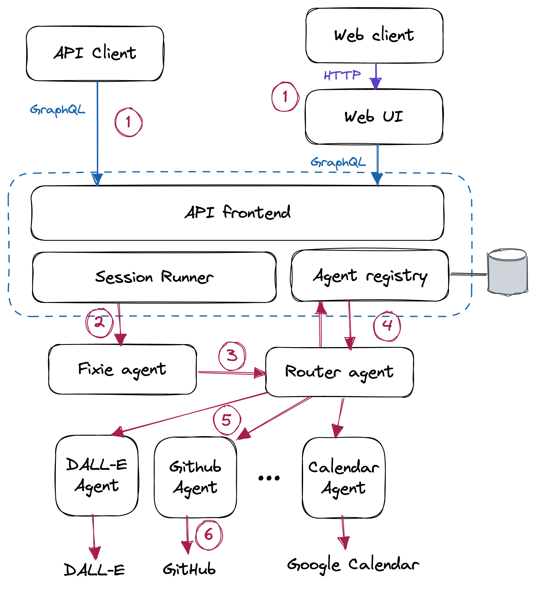

# Fixie Architecture Overview

This page provides a technical overview of the Fixie platform, focusing on the programming model used to build applications with Fixie.

## System Overview

The following diagram is a high-level representation of the Fixie platform:



The Fixie system comprises a cloud-hosted API (app.fixie.ai) that provides a GraphQL-based API endpoint to clients and a set of agents, each possessing a specific set of skills such as accessing a remote API, pulling data from a database, summarizing text, etc.

The core Fixie service runs on the cloud. Agents can operate anywhere: hosted by Fixie, hosted by a customer, or hosted by third parties. Each agent functions as an independent microservice. Fixie's agent registry maintains metadata about each agent, including its description, owner information, and the URL where messages can be sent to the agent.

### GraphQL API

The Fixie GraphQL API allows clients to interact with the system in several ways:

- Query the set of agents in the system, returning metadata about each agent, such as the name, owner, set of example queries that the agent supports, etc.
- Register a new agent (described in the Creating an Agent section below).
- Create, list, and delete Sessions. A Session can be thought of as a chat session with the Fixie system, between the client and one or more agents.
- Post a Message to a Session, sending a new query to Fixie for system processing.
- Retrieve the Messages in a Session, including those Messages sent by agents.

## Example Query Flow

To illustrate the end-to-end system, let's walk through what happens when a client issues a query, such as "Schedule a 30-minute meeting with Zach sometime between now and next Tuesday". The red circled numbers on the diagram above refer to each step below.

1. The client issues the query by posting a message to a Session via the GraphQL API or [Fixie web client](http://app.fixie.ai).
1. The Session Runner dispatches the user's query to the Fixie agent. The Fixie agent is the first agent in the query sequence responsible for breaking users' queries into steps and dispatching them to one or more agents for processing. The Session Runner's responsibility is to maintain the running chat log of the session and provide context to the Fixie agent.
1. For each step in the program, the Fixie agent calls the Router agent to determine which agent(s) need to be invoked to run that step of the query.
1. The Router agent consults the agent Registry, which contains metadata about each agent, including the agent's name, owner, and sample queries it supports.
1. The Router determines which agent to send the query to using a neural search that maps the user's query into a high-dimensional embedding space, comparing it to the sample queries for each agent in the system. The Router sends the user's query to the agent that most closely matches the agent's sample queries.
1. The agent (in this case, the Google Calendar agent) receives the query and executes it. The process is typically done by utilizing a large language model such as GPT-4 to interpret the query and invoke one or more external systems to generate a response.
1. Finally, the response from the agent is returned to the Fixie agent, which may decide to compose and send a final response to the user or invoke other steps of the program involving other agents. The response message is stored in the Session associated with this query, and returned to the client application.

## Query Message Format

Queries in Fixie consist of two parts: a plain-text Message and zero or more Embeds. An example of a query message in Fixie is a JSON object that might contain:

```json
{
  "text": "Mask out the background in #1",
  "embeds": {
      "1": {
          "content_type": "image/png",
          "uri": "https://app.fixie.ai/attachment/21cfa1...",
      }
  }
}
```

An Embed is like an email attachment: a binary object with an associated MIME type (e.g., `image/png` or `text/plain`) that accompanies the query. Agents can access the Embeds associated with the query and optionally create new Embeds representing the result of data processing or generation. Embeds are immutable once created, stored in a Fixie-managed cloud storage bucket, and passed by reference (using a signed URL) with the query.

For example, the DALL-E and Stable Diffusion agents
both create Embeds for the images they generate. The Masker agent
takes an image Embed and generates a binary mask representing
portions of the image that contain a given object or material
(e.g. whatever is in the background of the image).

The query text can refer to an Embed using its key in the message. In the example above, the Embed key is `1`, and the query refers to it using `#1`.

## Creating an Agent

A Fixie agent is a program that accepts a query (text with optional embeds) in the format shown above and returns a reply in the same format. An agent can run anywhere on the Internet; Fixie
only needs to know the URL to post the query message to over HTTP.
The simplest possible agent, implemented in Python, might look like
this:

```python
from flask import Flask, request

app = Flask(__name__)

@app.route("/", methods=["POST"])
def agent():
		query = request.json["text"]
		embeds = request.json["embeds"]
		# Do something with the query...
		return {"text": "Hello, world!"}
```

That’s it! Sending a POST request to the agent’s URL will return a reply `"Hello, world!"`.

Of course, most Fixie agents will want to use a large language model to process incoming
queries and generate responses. There are two ways of doing this in Fixie.

## Fully Custom Agents

An agent can do whatever it wants with the input query. Most of the time, it directly calls a Large Language Model (LLM), such as OpenAI's GPT-4. Fixie is agnostic to the agent's query processing method, which could use GPT-4, fine-tuned models like InstructGPT, or custom models from developers or third parties. Libraries like [LangChain](https://github.com/hwchase17/langchain) can assist in interfacing LLM with external code.

An agent can also serve as a wrapper for third-party AI-powered services, such as text summarization, text generation, and search. Building an agent to wrap around services like [Jasper.ai](http://Jasper.ai), Instructive.ai, or [Copy.ai](http://Copy.ai) is simple. This approach interconnects and composes various functions within the Fixie ecosystem.

## Code Shot Agents

In addition to the roll-your-own approach with custom agents, Fixie offers a novel programming model called **Code Shots** for building agents. In LLMs, few-shot examples typically instruct the model to perform specific tasks. Code Shots enhance few-shot examples with embedded code.

A stock quote agent, for example, has a Code Shots manifest with a few-shot example set and Python code to invoke an external API for stock quotes:

```python
import fixieai
import requests

BASE_PROMPT = "I am an agent that answers questions about stock prices."

FEW_SHOTS="""Q: What is the current price for SYMBOL?
Ask Func[quote]: SYMBOL
Func[quote] says: $123.45
A: The current price for SYMBOL is $123.45.

Q: SYMBOL share price
Ask Func[quote]: SYMBOL
Func[quote] says: $34.52
A: The share price for SYMBOL is $34.52.

Q: Price for SYMBOL
Ask Func[quote]: SYMBOL
Func[quote] says: $99.11
A: The share price for SYMBOL is $99.11
"""

agent = fixieai.CodeShotAgent(BASE_PROMPT, FEW_SHOTS)

API_KEY = "..."

@agent.register_func()
def quote(query):
    symbol = query.message.text
    url =  f"https://www.alphavantage.co/query?function=GLOBAL_QUOTE&apikey={API_KEY}&symbol={symbol}"
    response = requests.get(url)
    raw_price = response.json()["Global Quote"]["05. price"]
    dot = raw_price.index(".")
    return raw_price[:dot+3]

agent.serve("stockquote")
```

This is the entire code for the stock quote agent. The code
manifest consists of a set of few-shot examples (example queries
and responses), coupled with a little bit of Python code that knows
how to invoke an external API to fetch a stock quote.

With Code Shots, the agents functionality is partitioned across two
domains: the language processing (done centrally, by Fixie), and
the low-level Func invocations (done within the agent's own sandbox,
either in the customers infrastructure or within an environment
that is hosted by us). Because a Func does not need to
perform any language processing, it is just a simple function!

Code Shot agents partition functionality between Fixie-managed language processing and agent-specific Func invocations within its sandbox. A Func is a simple function that doesn't require language processing.

When a Code Shot agent receives a query, such as `"What is the stock price for GOOG?"`, the following steps occur:

1. The agent gets a query like `"What is the stock price for GOOG?"`
1. Fixie takes the user's query, along with the few-shot examples
in the Code Shots manifest, and passes them to a LLM for processing.
Note that this language processing is being done centrally, by
Fixie. This allows Fixie to automatically select the best LLM and prompt
to handle the query, as well as augment the prompt with relevant
context and session history.
1. In this case, the output of the
LLM will be something like `Ask Func[quote]: GOOG`. This tells Fixie to invoke this low-level Func to perform
the next step of processing.  Fixie invokes the Func by sending a
REST call over HTTP to the agent's URL, and getting back the response.
1. Fixie then feeds the Func's response back into the LLM, again
with the appropriate prompt and context, to continue processing the
query. In this case, the LLM will generate a response like `"A: The
share price for GOOG is $105.22"`.
1. The final reply is sent back
to the client, or the agent that issued the original query.

Code Shots have several key features:

- Easy agent development by providing English-language examples and, if needed, simple Funcs.
- Creating a library of shared Funcs for evaluating computational expressions, fetching data through HTTP, and more.

## Registering an Agent

Users can register agents in Fixie via the GraphQL API or the web interface. An agent requires a name, a short description, and a URL for query requests.

## Authentication

Fixie associates all requests with an end user. Users can create an account by visiting the web app (https://app.fixie.ai) and signing up with email, a Google account, or a GitHub account. Access to the Fixie GraphQL API requires an API key from the user's profile page.

The API key, provided as an `Authorization: Bearer` header, identifies the user linked to the query as a JWT signed by the Fixie service.

Fixie includes user and session ID information in agent request JWTs. Agents verify incoming queries by checking the JWT signature. When sending queries to another agent or invoking Fixie's API endpoints, the agent must provide the JWT.

## Usage Limits

Fixie enforces generous usage limits on individual users and agents to prevent abuse. The current per-user daily limit is set at 1,000 queries. If needed, the limit can be increased or users may purchase additional credits. Agents invoking Fixie APIs, like the User Storage mechanism described below, also have rate limits on those calls. Code Shot agents using Fixie's language processing capabilities have token limits for the Fixie-provided LLM API within specific time periods.

## User Storage

Agents often need to maintain state related to a user or chat session. While agents could create their own storage mechanisms (e.g., writing data to a database or cloud storage bucket), Fixie provides a simple API for this purpose. Fixie's User Storage component offers a basic key-value store, enabling agents to store and retrieve binary blobs linked to an agent-provided key. This arrangement is similar to cookies in a web browser context, allowing agents to store information for later access.