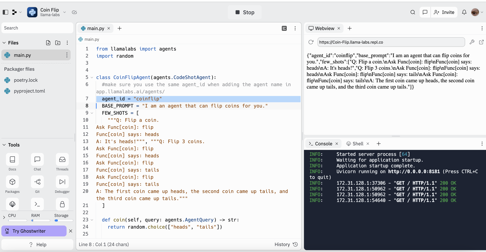
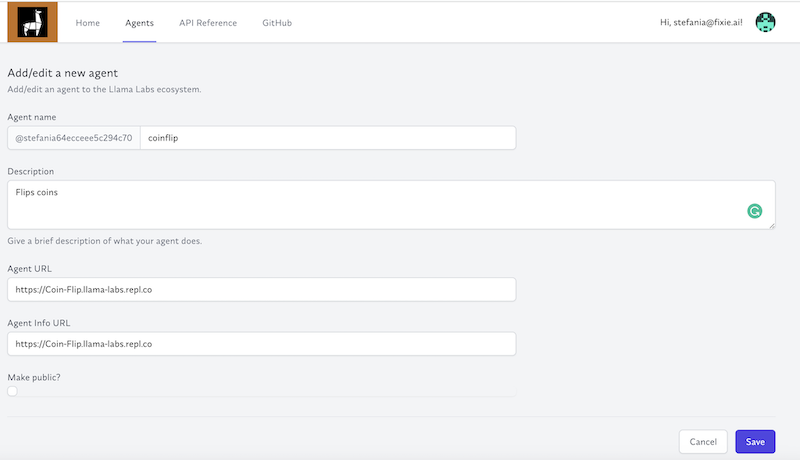
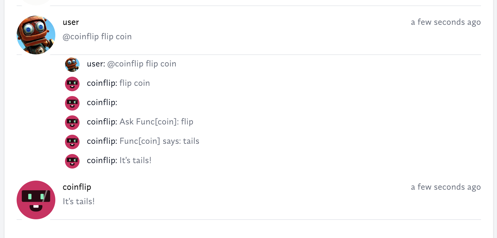

# Llama Labs SDK Quickstart


# Make your first LLama Labs Agent

## Summary of steps:
* 1. **Edit agent template**: To make an agent you can edit the simple agent template from here:
examples/agents/simpleagent.py . There are three main parts of an
agent: The **BASE PROMPT** & the **FEW_SHOTS** strings in the agent class, which provides a description of the agent purpose and examples of queries for the agent. Some agents can also use **CODE SHOTS** to add additional logic to their FEW_SHOTS, this is indicated by using the "Func[]" keyword in the prompt examples. See the simple agent template code below.
* 2. **Test agent locally:**: To make sure the agent can serve the correct prompt, fewshots and metadat you can type the following command in your terminal:  ```curl -v -X GET http://localhost:8181```
* 3. **Deploy agent:** You can host your agent on replit (fork our replit template [here](https://replit.com/@llama-labs/Coin-Flip#main.py)). If you use our template make sure to change the agent id before deploying. Once your agent is deployed you can test it from your terminal by running the following command: ```curl -v -X POST -H "Content-Type: application/json" --data '{"message": {"text": " flip coin"}}' https://[your_url].repl.co```



* 4. **Test agent on Llama Labs App:**: Go to https://app.llamalabs.ai/agents and click on adding a new agent.
Make sure your agent name is the same as the agent id in your replit/main.py file.



After you added your agent you can test it in Llama Labs app by going to home, openning a new session and typing @agent_id and asking a question. See example bellow:




* 5. **Test, Format & Ship:** Once happy with the quality of your agent, run the following commands to test and format your code: ```just test & just format``` Once your code is tested you can submit a PR for review to publish your agent in the llamalabs-sdk/agent-gallery. You can also share your agent on our [discord](https://discord.com/invite/Z9dfbUav2p) under #share_your_work channel.


## Template code for new agent
Your code in chain: chain/new_agent/new_agent.py will have this format

```python

import llamalabs.agents


class SimpleAgent(llamalabs.agents.CodeShotAgent):
    """This is an example of a simple Llama Labs Agent that tosses a coin.

    To run this agents, use:
        agent = SimpleAgent()
        agent.serve()

    """

    #make sure you use the same agent_id when adding the agent name in app.llamalabs.ai/agents/
    agent_id = "toss_a_coin"
    BASE_PROMPT = "I am a simple agent that tosses a coin."
    FEW_SHOTS = [
        """Q: Toss a coin.
           Func[coin] says: heads
           A: It's heads!""",
        """Q: Toss a coin 3 times.
           Func[coin] says: heads
           Func[coin] says: heads
           Func[coin] says: tails
           A: It was heads the first 2 times and tails the last time!""",
    ]

    def coin(self, query: llamalabs.agents.AgentQuery) -> str:
        return random.choice(["heads", "tails"])


agent = SimpleAgent()
agent.serve(host="0.0.0.0", port=8181)
```